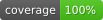

# my-sails-sample



> Coverage badge (`coverage/badges.svg`) is updated by CI (`.github/workflows/unit-tests.yml`) via `npm run coverage`.
> If a pull request changes test coverage, regenerate the badge locally with `npm run coverage` and include the updated `coverage/badges.svg` in the commit.

a [Sails v1](https://sailsjs.com) application

### Local E2E setup

Before running Playwright E2E tests locally, install browser binaries and OS dependencies:

```bash
npx playwright install --with-deps
```

> In CI, this can be replaced by a dedicated Playwright setup action.

### Links

+ [Sails framework documentation](https://sailsjs.com/get-started)
+ [Version notes / upgrading](https://sailsjs.com/documentation/upgrading)
+ [Deployment tips](https://sailsjs.com/documentation/concepts/deployment)
+ [Community support options](https://sailsjs.com/support)
+ [Professional / enterprise options](https://sailsjs.com/enterprise)


### Version info

This app was originally generated on Fri Jul 25 2025 13:37:51 GMT+0000 (Coordinated Universal Time) using Sails v1.5.17.

<!-- Internally, Sails used [`sails-generate@2.0.13`](https://github.com/balderdashy/sails-generate/tree/v2.0.13/lib/core-generators/new). -->


<!--
Note:  Generators are usually run using the globally-installed `sails` CLI (command-line interface).  This CLI version is _environment-specific_ rather than app-specific, thus over time, as a project's dependencies are upgraded or the project is worked on by different developers on different computers using different versions of Node.js, the Sails dependency in its package.json file may differ from the globally-installed Sails CLI release it was originally generated with.  (Be sure to always check out the relevant [upgrading guides](https://sailsjs.com/upgrading) before upgrading the version of Sails used by your app.  If you're stuck, [get help here](https://sailsjs.com/support).)
-->
